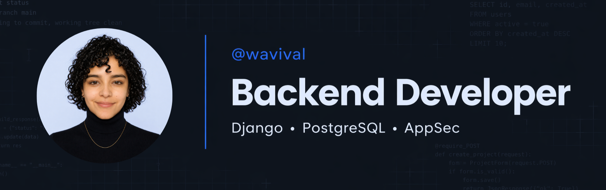

<h1 align="left">
  
  wavival.dev • Portfolio
</h1>


> Portfolio of **Valentina Ramírez** — Backend Developer, AppSec enthusiast, Founder of [Lúmina W](https://luminaw.co). Third iteration of the site, built with Astro 6 and Tailwind 3. Static-rendered, dark-mode aware, SEO + A11Y + performance first. Deploys to Netlify in one click.

[](https://wavival.dev)
[](https://luminaw.co)
[](https://blog.luminaw.co)

## Table of contents

- [Stack](#stack)
- [Local setup](#local-setup)
  - [npm scripts](#npm-scripts)
- [Environment variables](#environment-variables)
- [Project conventions](#project-conventions)
- [Architecture](#architecture)
  - [Page composition](#page-composition)
  - [Design tokens](#design-tokens)
- [SEO and accessibility](#seo-and-accessibility)
- [Performance](#performance)
- [Testing](#testing)
- [Deploying to Netlify](#deploying-to-netlify)
  - [One-time setup](#one-time-setup)
  - [What's already in the repo](#whats-already-in-the-repo)
  - [Security headers and cache](#security-headers-and-cache)
  - [Subpath proxy](#subpath-proxy)
- [Using as a template](#using-as-a-template)
- [Troubleshooting](#troubleshooting)
- [Roadmap / known gaps](#roadmap--known-gaps)
- [License](#license)

Related docs: [DESIGN.md](./DESIGN.md) · [COMPONENTS.md](./COMPONENTS.md) · [CLAUDE.md](./CLAUDE.md)

## Stack

| Layer     | Choice                                                               |
| --------- | -------------------------------------------------------------------- |
| Build     | Astro 6 (static output, `compressHTML`, `inlineStylesheets: 'auto'`) |
| Styling   | Tailwind CSS 3 (`darkMode: 'class'`) + CSS custom property tokens    |
| Scripts   | TypeScript (vanilla, no client-side framework)                       |
| Sitemap   | `@astrojs/sitemap` (auto-generated at build)                         |
| Animation | AOS 2 (Animate On Scroll), respects `prefers-reduced-motion`         |
| Fonts     | Google Fonts (Raleway + Poppins), async non-blocking load            |
| Analytics | Google Analytics 4, env-driven, conditionally injected               |
| LLM SEO   | `/llms.txt` (llmstxt.org spec) for AI-assistant discovery            |
| Testing   | Playwright (Chromium desktop + mobile)                               |
| CI        | GitHub Actions: format check → build → Playwright E2E                |
| Hosting   | Netlify (static publish + SPA fallback + security headers + cache)   |

## Local setup

```bash
git clone git@github.com:wavival/wavival.dev.git
cd wavival.dev
npm install
cp .env.example .env             # fill in PUBLIC_GA_ID and PUBLIC_GSV if needed
npm run dev                      # http://localhost:4321
```

`.npmrc` pins `legacy-peer-deps=true` because `@astrojs/tailwind@6` declares an Astro 3/4/5 peer range while the site is on Astro 6 — the integration works fine in practice.

**Requires:** Node `>=22.12` (declared in `package.json` engines; CI pins `22`).

### npm scripts

| Script                 | What it does                                      |
| ---------------------- | ------------------------------------------------- |
| `npm run dev`          | Astro dev server with HMR at `localhost:4321`     |
| `npm run build`        | `astro build` → static output in `./dist/`        |
| `npm run preview`      | Serve the production build locally                |
| `npm run check`        | `astro check` (type / diagnostic check)           |
| `npm run format`       | Prettier write across the repo                    |
| `npm run format:check` | Prettier check (no writes), used in CI            |
| `npm test`             | Playwright E2E (boots `preview` automatically)    |
| `npm run test:ui`      | Playwright in interactive UI mode                 |
| `npm run test:install` | Install Playwright Chromium browser + system deps |

## Environment variables

All client-exposed vars use the `PUBLIC_` prefix (Astro convention). They are baked into the static build at compile time — there is no runtime config.

| Variable       | Required | Example        | Notes                                                                  |
| -------------- | -------- | -------------- | ---------------------------------------------------------------------- |
| `PUBLIC_GA_ID` | No       | `G-XXXXXXXXXX` | Google Analytics 4 Measurement ID. Empty → GA `<script>` not injected. |
| `PUBLIC_GSV`   | No       | `abc123...`    | Google Site Verification token. Empty → `<meta>` not injected.         |

Copy `.env.example` to `.env` for local development. In Netlify, set both under _Site settings → Environment variables_.

## Project conventions

- **No hardcoded colors.** Every color reference uses `var(--token-name)` from `src/styles/tokens.css`.
- **Utility classes for repeats.** `.section`, `.btn-primary`, `.card`, `.chip`, `.link`, etc. live in `@layer utilities` (`src/styles/utilities.css`).
- **Astro components** type props with `interface Props` in the frontmatter.
- **External links** go through `Link.astro` / `Button.astro` — both apply `rel="noopener noreferrer"` automatically when `target="_blank"`.
- **Images:** WebP for photos, SVG for icons. Always include explicit `width` + `height` HTML attributes to prevent CLS. Decorative icons use `alt=""`.
- **Dark mode** uses the `.dark` class on `<html>` — never `@media (prefers-color-scheme)`. A blocking `is:inline` script in `Layout.astro` `<head>` applies the saved theme before first paint to avoid FOUC.
- **No client-side frameworks.** Vanilla TypeScript in `src/scripts/` is the only client code.

Full design-token reference and utility-class catalog: see [DESIGN.md](./DESIGN.md). Component-by-component prop tables: see [COMPONENTS.md](./COMPONENTS.md).

## Architecture

Single-page site, two routes only:

- `/` → `src/pages/index.astro`
- `/404` → `src/pages/404.astro` (`noindex`)

```
src/
├── components/
│   ├── sections/        # Hero · Projects · Stack · About · Contact
│   └── ui/              # Button · Link · NavBar · Footer
├── layouts/
│   └── Layout.astro     # Full <head> · pre-paint theme · skip link · NavBar · Footer
├── pages/
│   ├── index.astro      # Composes all sections
│   └── 404.astro        # Error page (noindex)
├── scripts/
│   ├── nav.ts           # Mobile menu + Escape handler
│   └── theme.ts         # Dark/light toggle + localStorage (post-paint sync)
└── styles/
    ├── global.css       # Imports + body base + prefers-reduced-motion
    ├── tokens.css       # CSS custom properties (design tokens)
    └── utilities.css    # @layer utilities — custom classes
public/
├── brand/               # logo-w.webp, logo-w.ico
├── icons/ui/            # Decorative SVG icons
├── images/              # profile.webp
├── cv_valentina_ramirez.pdf
├── llms.txt             # llmstxt.org descriptor for AI assistants
└── robots.txt           # Points at /sitemap-index.xml (generated)
tests/                   # Playwright E2E suites
.github/workflows/ci.yml # Format check → build → Playwright E2E
```

### Page composition

```astro
<Layout>
  <Hero />
  <Projects />
  <Stack />
  <About />
  <Contact />
</Layout>
```

`Layout.astro` owns the entire document head (meta, OG, Twitter, JSON-LD, conditional GA, fonts, AOS init, pre-paint theme script), the skip link, the `<NavBar />`, and the `<Footer />`. Pages render inside `<main id="main-content">`.

### Design tokens

`src/styles/tokens.css` defines every color, radius, shadow, and section spacing as a CSS custom property on `:root` and overrides the subset that needs to invert on `.dark`. Components reference them via `var(--token)`; no hex codes in component files.

Brand palette quick-reference:

| Token            | Hex                          | Usage               |
| ---------------- | ---------------------------- | ------------------- |
| `--brand-blue`   | `#407bff`                    | Primary brand color |
| `--accent-link`  | `#1e90ff`                    | Links, focus rings  |
| `--accent-hover` | `#1a7fe0`                    | Link / button hover |
| `--bg-page`      | `#f0f4ff` / `#0f1117` (dark) | Body background     |
| `--text-primary` | `#1a1a2e` / `#e8eaf6` (dark) | Headings, copy      |
| `--text-muted`   | `#4b5563` / `#9ca3af` (dark) | Secondary copy      |

Full token table, dark overrides, utility classes, typography, motion, and A11Y notes: **[DESIGN.md](./DESIGN.md)**.

## SEO and accessibility

`Layout.astro` ships a full baseline so every route inherits it automatically.

**SEO:**

- Meta title, description, author, robots (`max-snippet:-1`, `max-image-preview:large`)
- Canonical URL built from `Astro.url.pathname` against `https://wavival.dev`
- OpenGraph (image with `width="640" height="640"` + `alt`, locale `es_CO`)
- Twitter Card (`summary_large_image`)
- JSON-LD: `Person` + `WebSite` schemas inside one `@graph`
- `lang="es"` on `<html>`
- `PUBLIC_GSV` → `<meta name="google-site-verification">` (only when set)
- `/sitemap-index.xml` auto-generated by `@astrojs/sitemap`, referenced from `/robots.txt`
- `/llms.txt` describes the site for AI assistants per [llmstxt.org](https://llmstxt.org) — improves discovery by LLM-powered search

**A11Y:**

- Skip link to `#main-content` (visible on focus)
- Heading hierarchy: one `h1` in Hero, `h2` per section, `h3` inside cards
- `aria-label` on every interactive element
- `aria-expanded` + `aria-controls` on the mobile menu trigger; Escape closes the menu
- `role="list"` on desktop nav `<ul>`
- Decorative `` always has `alt=""`
- `focus-visible:ring-2 focus-visible:ring-[var(--accent-link)]` on icon-only buttons
- WCAG AA contrast verified for `--text-muted` over `--bg-page` in both themes

## Performance

- Pre-paint theme script (sync `is:inline` in `<head>`) applies `.dark` before first paint — zero FOUC.
- Hero portrait: WebP, `fetchpriority="high"`, `decoding="async"`, explicit 320×320, plus `<link rel="preload" as="image">` in `<head>` to win LCP.
- Google Fonts: async non-blocking load (`media="print"` + `onload="this.media='all'"`) + `<noscript>` fallback; `preconnect` to `fonts.googleapis.com` and `fonts.gstatic.com`.
- Google Analytics: `is:inline async`, conditionally rendered (no GA = no script tag = no network call).
- Every icon `` has explicit `width` + `height` to prevent CLS.
- AOS: `once: true`. Under `prefers-reduced-motion`, `duration: 0`, `offset: 0`.
- Astro: `compressHTML: true`, `build.inlineStylesheets: 'auto'` — small critical CSS inlined into the document.
- Netlify cache: `/_astro/*`, `/images/*`, `/brand/*`, `/icons/*` served `Cache-Control: public, max-age=31536000, immutable`. PDF is `max-age=86400`. HTML uses Netlify defaults (revalidate on each deploy).

## Testing

End-to-end smoke tests live in `tests/` and run against `npm run preview` (Playwright boots the server automatically via `playwright.config.ts`).

```bash
npm run test:install       # one-time: download Chromium + system deps
npm test                   # boot preview, run full suite
npm run test:ui            # Playwright UI mode for local debugging
```

Two projects run by default:

- `chromium-desktop` (Desktop Chrome)
- `chromium-mobile` (Pixel 5)

| Suite                 | Covers                                                                            |
| --------------------- | --------------------------------------------------------------------------------- |
| `home.spec.ts`        | Single h1, canonical/OG host, JSON-LD types, hero image attrs, anchors, skip link |
| `theme.spec.ts`       | Pre-paint dark/light from `localStorage`; toggle flips + persists                 |
| `mobile-menu.spec.ts` | Open/close, `aria-expanded`, Escape, link-click closes menu                       |
| `not-found.spec.ts`   | `/404` renders heading and emits `noindex`                                        |
| `seo.spec.ts`         | `robots.txt` content + `sitemap-index.xml` generated by integration               |

CI runs the full suite on every PR (`.github/workflows/ci.yml`).

## Deploying to Netlify

### One-time setup

1. **Create site:** Netlify dashboard → _Add new site_ → _Import from Git_ → select repo.
2. **Build settings** (auto-detected from `netlify.toml`):
   - Build command: `npm run build`
   - Publish directory: `dist`
   - Node version: `22` (pinned in `[build.environment]`)
3. **Environment variables** → _Site settings → Environment variables_:
   - `PUBLIC_GA_ID` (optional)
   - `PUBLIC_GSV` (optional)
4. **Custom domain:** _Domain settings_ → add `wavival.dev` → follow CNAME instructions. SSL auto-provisions via Let's Encrypt.
5. **Deploy:** push to `main`. CI runs format check → build → Playwright E2E; on green, Netlify auto-builds and publishes.

### What's already in the repo

- `netlify.toml` — Node 22 pin, security headers, immutable cache for static assets, subpath proxy.
- `astro.config.mjs` — `site: "https://wavival.dev"`, sitemap integration, HTML compression.
- `public/robots.txt`, `public/llms.txt` — `sitemap-index.xml` generated at build.
- `.github/workflows/ci.yml` — quality + e2e gates before Netlify deploys.

### Security headers and cache

`netlify.toml` declares:

| Header                                               | Value                                                  |
| ---------------------------------------------------- | ------------------------------------------------------ |
| `Content-Security-Policy`                            | Strict CSP allowing GA + Google Fonts only             |
| `Strict-Transport-Security`                          | `max-age=63072000; includeSubDomains; preload`         |
| `X-Frame-Options`                                    | `DENY`                                                 |
| `X-Content-Type-Options`                             | `nosniff`                                              |
| `Referrer-Policy`                                    | `strict-origin-when-cross-origin`                      |
| `Permissions-Policy`                                 | Locks camera, microphone, geolocation, interest-cohort |
| Cache (`/_astro/`, `/images/`, `/brand/`, `/icons/`) | `public, max-age=31536000, immutable`                  |

If you add a third-party endpoint (Sentry, PostHog, etc.) update `script-src` / `connect-src` in the CSP.

### Subpath proxy

`netlify.toml` proxies `wavival.dev/nullbreach/*` to the separate NullBreach Netlify site:

```toml
[[redirects]]
  from = "/nullbreach/*"
  to = "https://null-breach.netlify.app/:splat"
  status = 200
  force = false
```

Update or remove if the upstream changes.

## Using as a template

You're welcome to clone this repo as a base for your own portfolio. Design system, layout primitives, and SEO/A11Y baseline are reusable.

**Do not copy the personal content** — copy, images, projects, and contact details belong to Valentina Ramírez and are not covered by the license.

### Files to replace

| File                                     | Data to change                                                                          |
| ---------------------------------------- | --------------------------------------------------------------------------------------- |
| `src/layouts/Layout.astro`               | Default title, description, JSON-LD (name, jobTitle, worksFor, sameAs), `site` constant |
| `astro.config.mjs`                       | `site` URL                                                                              |
| `src/components/sections/Hero.astro`     | Name, tagline, CV URL, social links                                                     |
| `src/components/sections/Projects.astro` | `projects` array (title, tag, stack, problem, solution, links)                          |
| `src/components/sections/Stack.astro`    | `stack` array (categories and tools)                                                    |
| `src/components/sections/About.astro`    | Bio, personal quote, additional links                                                   |
| `src/components/sections/Contact.astro`  | Contact email                                                                           |
| `src/components/ui/NavBar.astro`         | CTA email, blog URL                                                                     |
| `src/components/ui/Footer.astro`         | Name in copyright, Lúmina W links                                                       |
| `public/robots.txt`                      | Sitemap absolute URL                                                                    |
| `public/llms.txt`                        | Personal description, projects, links                                                   |
| `public/cv_valentina_ramirez.pdf`        | CV file (rename + update Hero href)                                                     |
| `public/images/profile.webp`             | Profile photo (640×640 recommended)                                                     |
| `public/brand/logo-w.*`                  | Brand logo                                                                              |
| `.env.example`                           | `PUBLIC_GA_ID`, `PUBLIC_GSV`                                                            |

Token, typography, and utility-class values are centralized in `src/styles/` — re-skin without touching components.

## Troubleshooting

| Symptom                                          | Fix                                                                                                                               |
| ------------------------------------------------ | --------------------------------------------------------------------------------------------------------------------------------- |
| `npm install` fails on `ERESOLVE` peer warning   | `.npmrc` already sets `legacy-peer-deps=true`. If you removed it, re-add or run `npm install --legacy-peer-deps`.                 |
| Dark mode flashes on first paint                 | The pre-paint script lives at the top of `<head>` in `Layout.astro`. Don't move it below other tags.                              |
| Fonts flash unstyled (FOUT)                      | Expected with the `media="print"` + `onload` strategy. To eliminate, self-host Poppins + Raleway and drop the Google Fonts links. |
| 404 on direct deep-link (`/anything`)            | Only `/` and `/404` exist — Astro returns a real 404. SPA fallback isn't needed; the site is static.                              |
| GA not firing                                    | Confirm `PUBLIC_GA_ID` is set in Netlify env vars and the build was triggered after setting it.                                   |
| Playwright fails locally with "browsers missing" | Run `npm run test:install` once.                                                                                                  |
| CSP blocks a new third-party script              | Edit `Content-Security-Policy` in `netlify.toml` to add the origin to `script-src` / `connect-src`.                               |

## Roadmap / known gaps

- **Google Fonts external.** Poppins + Raleway are pulled from `fonts.gstatic.com`. Self-hosting would remove a third-party connect, remove FOUT risk, and shrink the CSP `font-src`.
- **Visual regression.** Playwright covers structure + behavior, not pixels. Add `toHaveScreenshot()` baselines once the design is frozen.
- **Lighthouse CI.** Performance budget isn't enforced in CI. Add a `lighthouse-ci` job in `.github/workflows/ci.yml` and assert thresholds.
- **Image variants.** No `<picture>` / `srcset` for the hero portrait — single WebP at 320×320. Acceptable for current LCP, but multi-resolution would help retina.
- **OG image dedicated.** OG image is the profile photo (640×640). A purpose-built 1200×630 banner would render better on social.
- **WhatsApp / contact button.** No floating WhatsApp CTA on the portfolio (unlike the NullBreach UI). Add if conversion matters.

## License

This project is licensed under the **MIT License**, with the following clarification:

- **Clone**: Clone this repository freely
- **Fork**: Fork and create your own version
- **Contribute**: Pull requests and contributions welcome
- **Learn**: Use this code to study and learn frontend architecture
- **Modify**: Adapt the code to your needs
- **Attribution**: Please credit the original author (Valentina Ramírez / @wavival)

The **content** (copy, images, projects, CV, brand assets) belongs to Valentina Ramírez and is **not** covered by the MIT license. See the [LICENSE](./LICENSE) file for the full text.

Copyright © 2026 Valentina Ramírez.

## Contact



<h3 align="left">
  
  Valentina Ramírez • @wavival
</h3>

> Thanks for getting here. Let's build great things.

[](https://www.linkedin.com/in/wavival)
[](https://www.instagram.com/wavival)
[](mailto:wavival.dev@luminaw.co)
